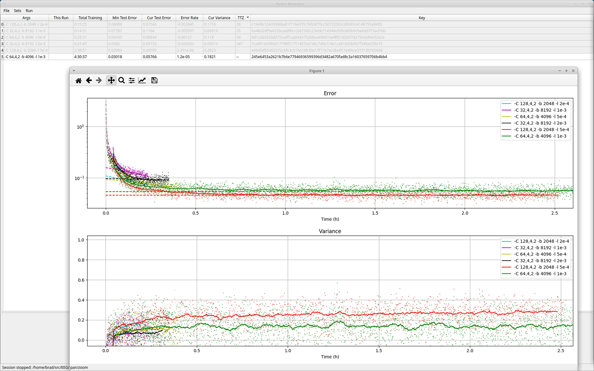
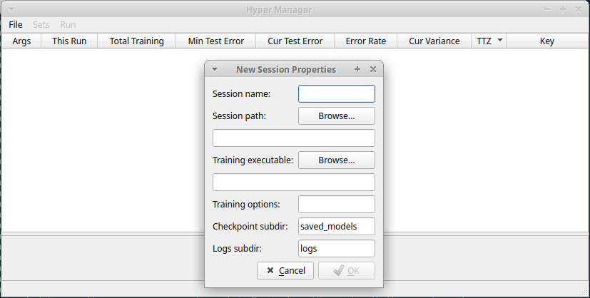

# hyper_manager

This UI tool is meant to assist with hyperparameter search when training
neural networks.  It invokes an external process to do the training, expecting
that process to checkpoint its work and eventually exit.  Different
hyperparameters are tracked based on the command-line options to the training
program required to set them up.  The rate of training progress is evaluated
based on Tensorboard log files emitted by the external process, and at each
interval a hyperparameter set is randomly selected for additional training,
weighted based on configurable parameters such as convergence rate or total
training time.  Hyperparameter sets may be selected for plotting of the loss
curves, or interactively inhibited from additional training.  Additional
hyperparameters may be manually added at any time.

## Dependencies

In addition to Tensorflow, this tool depends on PySide2 and matplotlib to
function:

 * `pip3 install matplotlib`
 * `pip3 install PySide2`

If you have Tensorflow in a virtual env, all three packages must be in the
same env, and the tool must be run from that environment.

## Instructions to use

To begin, invoke File/New Session.  You will be prompted for some properties
of the session:

 * "Session name" is the name of the new session to create.  A new folder will
   be created at the specified path to contain the session settings and
   training progress.
 * "Session path" is an existing folder to put the new session in.
 * "Training executable" is the tool to invoke to perform a training iteration.
 * "Training options" is a space-separated list of command-line options to be
   provided to the tool, common to *all* hyperparameters.  This might be
   invariant things such as a dataset file location, configuration of a common
   metric to use, and training duration.  NOTE: it is important that the
   training process exit on its own after a period of time (e.g. five minutes
   or so); probably, these options should configure that interval.
 * "Checkpoint subdir" is the location of the checkpoints (e.g. saved weights)
   emitted by the training process, relative to the working directory of the
   process.  Every distinct hyperparameter set is invoked in its own
   subdirectory of the session folder, and this directory is expected to be
   found under that.  When resuming training, the manager will look for json
   files in this folder, identify the most recent one lexicographically, and
   pass it to the training process with a '--resume-from' argument.
 * "Logs subdir" is the location of log data emitted by the training process,
   relative to the working directory of the process.  Error stats and plots
   will be based on scraping the Tensorboard logs found here.  If there is a
   single metric in the log, that will be used as the 'error'; with no
   metrics, the loss will be used.  Multiple metrics are not currently
   supported.

Once the session is created, sets of hyperparameters to test can be added via
the Set menu, and the training session can be started from the Run menu.

The TTZ column can be used to estimate which hyperparam sets will reach lower
error values sooner.  It is based on a linear fit to the error curve, and the
time for that projected line to intersect zero ("Time To Zero").  Obviously,
no training process follows a linear progression indefinitely, so this should
not actually be treated as a meaningful unit of time, only as a relative
ranking between sets taking into account current error and error rate.  This
column is also the default metric used to weight random selection when picking
a set to train for a new interval.

Individual hyperparam sets, or groups of sets, may be enabled and disabled
manually by selecting them and right-clicking, or using the Sets menu.
Additionally, a threshold on the variance can be configured to automatically
disable sets if the validation error becomes substantially worse than the
training error.
